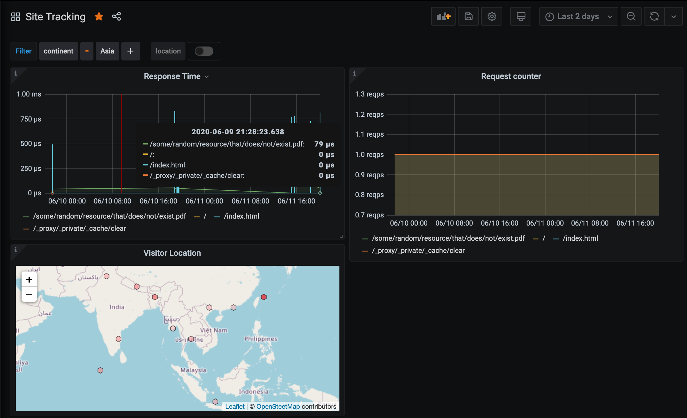

# Grafana Geo:JSON Datasource

* [Implementation](#implementation)
    * [Setup](#setup)
        * [Datasource](#datasource)
        * [Dashboard Variable](#dashboard-variable)
        * [Metric Name](#metric-name)
        * [Panel Query](#panel-query)
    * [Use Case](#use-case)
* [Configuration](#configuration)
* [Acknowledgements](#acknowledgements)

Datasource backend for the [Grafana Simple JSON](https://grafana.com/grafana/plugins/grafana-simple-json-datasource)
datasource plugin.

## Implementation

Retrieves events stored in *geo:json* format in [Akumuli](https://akumuli.org/)
in response the end endpoints mandated by the plugin.  We use the datasource to
display location information on Grafana using the [trackmap](https://github.com/alexandrainst/alexandra-trackmap-panel)
panel.

### Setup
Configuration of the datasource follows standard Grafana workflow.

#### Datasource
Deploy the service and point the **SimpleJson** datasource to use the service
as the backend provider.

#### Dashboard Variable
Grafana dashboards where this datasource is used can use a *variable* to add
**adhoc filters** to the Akumuli queries.  For the variable, select **Ad hoc filters**
as the **Type**.  Select **SimpleJson** as the **Data source**.  The variable
can be named as convenient.

The set up is illustrated in the following screen capture.

#### Metric Name
The other requirement is that the service be configured with a **metric** which
can be used to query for **tag keys** and **values**.  This is a limitation in
Grafana, where no **metric** context is available in the requests to the backend
service for tag keys or values.

#### Panel Query
Location query panels can be created using the **SimpleJson** datasource.  Select
the *timeserie* of interest using the list of series names returned by the
auto-complete (`/search`) service.

### Use Case
This service was developed to provide an insight into the geographic areas from
which visitors access web sites/applications.  In particular, this service is
used in conjunction with the [s3-proxy](https://github.com/sptrakesh/s3-proxy)
and [mmdb-ws](https://github.com/sptrakesh/mmdb-ws) services to provide analytics
related to visitors accessing front-end applications hosted from S3 buckets.

## Configuration
The server can be configured with the following options:
* `--port` - The *port* on which the server listens.  Default `8020`.
* `--threads` - Number of I/O threads for the server.  Defaults to `std::thread::hardware_concurrency`.
* `--akumuli-host` - Host name for connecting to *Akumuli*.
* `--akumuli-port` - Port on which *Akumuli* query service listens.  Default
is `8181`.
* `--metric-name` - Default *metric* to match against for the optional `/tag-keys`
and `/tag-values` endpoints.  Grafana *adhoc* filters are applied at the dashboard
level, and the requests do not contain any *metric* related information.  If not
specified, *tag* services will be disabled (return empty array).

## Acknowledgements
This software has been developed mainly using work other people have contributed.
The following are the components used to build this software:
* **[Boost:Beast](https://github.com/boostorg/beast)** - We use *Beast* for the
`http` server implementation.  The implementation is a modified version of the
[async](https://github.com/boostorg/beast/tree/develop/example/http/server/async)
example.
* **[Clara](https://github.com/catchorg/Clara)** - Command line options parser.
* **[NanoLog](https://github.com/Iyengar111/NanoLog)** - Logging framework used
for the server.  I modified the implementation for daily rolling log files.
* **[rapidjson](https://github.com/Tencent/rapidjson)** - JSON parser for parsing
request payload and response data from Akumuli.
